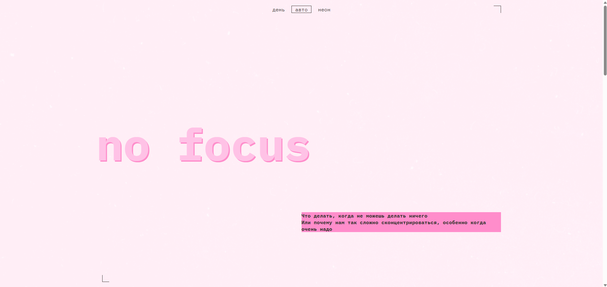
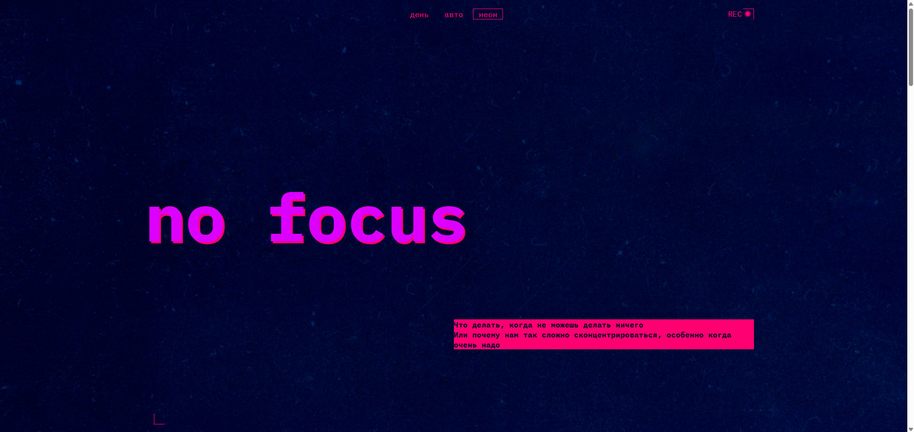

# 🎓 Проект "Сложно сосредоточиться"

[Просмотреть проект на GitHub](https://github.com/nikita-pugachev/slozhno-sosredotochitsya-fd.git)

[Посмотреть проект на GitHub Pages](https://nikita-pugachev.github.io/slozhno-sosredotochitsya-fd/)

## ⁉️ О проекте
Проект "Сложно сосредоточиться" - статья о том, почему нам так сложно сконцентрироваться на работе. Это моя третья работа в роли frontend-разработчика. В проекте реализованы навыки адаптивной вёрстки под десктоп, планшеты и телефоны. Так же для проекта написана логика на чистом JavaScript, для того, чтобы реализовать переключение тем, а их здесь три: светлая, темная и авто (как в системе или браузере).

## 👀 Взгляд на проект
<div align="center">


</div>

## 🔧 Используемые технологии
* HTML
* CSS
* JavaScript
* Реализовано переключение тем (светлая, темная, авто)
* Предусмотрен адаптив под мобильные устройства, планшеты и компьютеры

## 🚀 Установка и запуск
**1. Клонирование репозитория**
```bash
git@github.com:nikita-pugachev/slozhno-sosredotochitsya-fd.git
```
**2.Запуск**
* Открыть проект в VS Code
* [Установить плагин Live Server](https://marketplace.visualstudio.com/items?itemName=ritwickdey.LiveServer)
* Открыть просмотр проекта в любом браузере с помощью кнопки Go Live